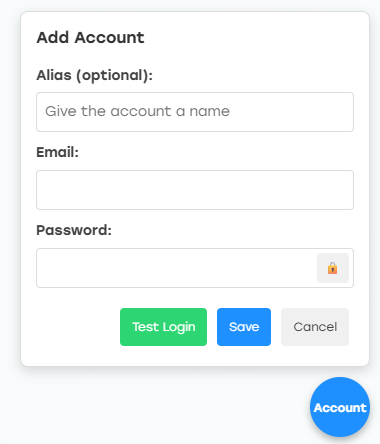
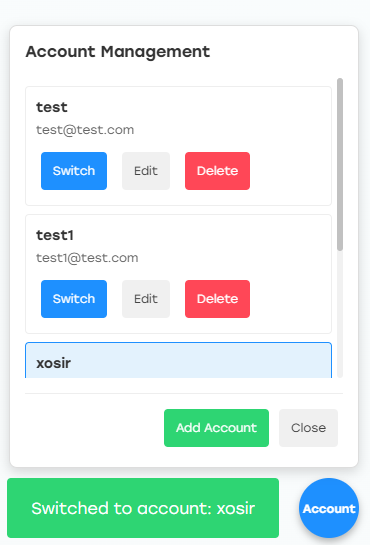
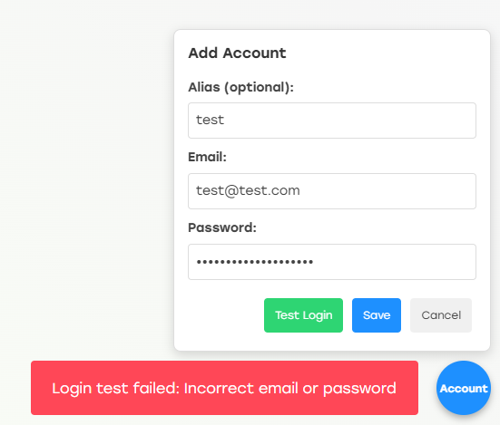

# zlib_account_manager
zlibraryのアカウントマネージャー

## 概要
このスクリプトは、Z-Libraryの複数アカウントを管理するためのユーザースクリプトです。アカウントの追加、編集、削除、切り替えが可能です。

## 機能
- [x] 複数のZ-Libraryアカウントの保存と管理
- [x] アカウントの簡単な切り替え
- [x] ログインテスト機能
- [x] アカウントの別名設定
- [ ] サーバーとの同期機能
- [ ] アカウントのエクスポート・インポート機能
- [ ] アカウント基本情報取得

## インストール方法
[violentmonkey](https://violentmonkey.github.io)それとも[Tampermonkey](https://www.tampermonkey.net)を使用して以下のURLからインストール:

```
https://raw.githubusercontent.com/lijunjie2232/zlib_account_manager/refs/heads/master/src/tamp_index.js
```

## 使い方
1. ブラウザにTampermonkeyなどのユーザースクリプト拡張機能をインストール
2. このスクリプトをインストール
3. Z-Libraryのサイトを開くと、右下に「Account」ボタンが表示されます
4. ボタンをクリックしてアカウントマネージャーを開く
5. アカウントを追加・編集・削除・切り替えできます

## screenshot
<table border="1">
<tr>
<th>add account</th>
<td></td>
</tr>
<tr>
<th>switch account</th>
<td></td>
</tr>
<tr>
<th>test account</th>
<td></td>
</tr>

</table>


## 注意事項
- アカウント情報はブラウザのローカルストレージに保存されます
- パスワードは暗号化されずに保存されるため、注意が必要です